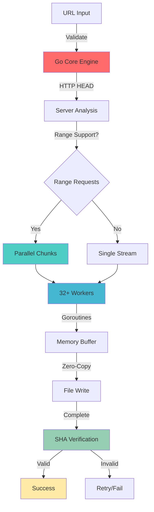

<div align="center">

<!-- Dynamic Header -->


<!-- Enhanced Badges -->
<p align="center">
  <a href="https://github.com/0xb0rn3/fastdl/releases">
    
  </a>
  <a href="https://github.com/0xb0rn3/fastdl/blob/main/LICENSE">
    
  </a>
  <a href="https://github.com/0xb0rn3/fastdl/stargazers">
    
  </a>
  <a href="https://github.com/0xb0rn3/fastdl/network/members">
    
  </a>
  <a href="https://github.com/0xb0rn3/fastdl/issues">
    
  </a>
</p>

<!-- Enhanced Animated Typing -->
<p align="center">
  
</p>

<!-- Enhanced Tech Stack Icons -->
<p align="center">
  
</p>

</div>

---

<div align="center">
  
### ⚡ **Blazing Fast** • 🔒 **SHA-256 Verified** • 🚀 **Production Ready** • **Go Powered**

</div>

---

## 🌟 **What Makes FastDL Special**

<table>
<tr>
<td width="50%" valign="top">

### 🔒 **Security First**
- **SHA-256/SHA-1/MD5 verification** built-in
- Automatic checksum validation
- Batch verification from checksum files
- Integrity validation before completion

### 📊 **Advanced Features**
- Real-time progress monitoring
- Enhanced error handling & retries
- SQLite job persistence
- System resource monitoring

</td>
<td width="50%" valign="top">

### 🌐 **Web Dashboard**
- Modern web interface
- RESTful API endpoints
- Real-time job management
- Mobile-responsive design

### 🎯 **Smart Optimization**
- Auto-detects server capabilities
- Adaptive connection scaling
- Intelligent chunk sizing
- Resume-ready architecture

</td>
</tr>
</table>

---

## 🚀 **Quick Start**

<div align="center">

### **One-Line Install & Launch**

```bash
# Download and run the installer
curl -sSL https://raw.githubusercontent.com/0xb0rn3/fastdl/main/run -o run && chmod +x run && ./run
```

<details> 
<summary><b>📋 Manual Installation</b></summary>

```bash
# Clone the repository
git clone https://github.com/0xb0rn3/fastdl.git
cd fastdl

# Run the installer
chmod +x run
./run
```

</details>

</div>

---

## 📸 **Screenshots**

<div align="center">
<table>
<tr>
<td><br/><b>Interactive Installation Menu</b></td>
<td><br/><b>Web Dashboard</b></td>
</tr>
<tr>
<td><br/><b>Terminal UI Mode</b></td>
<td><br/><b>Real-time Progress</b></td>
</tr>
</table>
</div>

---

## 💻 **Usage**

### **Interactive Mode** (Recommended)
```bash
# Launch the management interface
./run

# Or if installed globally
fastdl
```

### **CLI Commands**

<details>
<summary><b>🔥 Single Download with Verification</b></summary>

```bash
# Basic download
fastdl download https://example.com/file.iso

# With custom connections and output
fastdl download -c 64 -o ~/Downloads/myfile.iso https://example.com/file.iso

# With SHA-256 verification
fastdl download --sha256=abc123def456... https://example.com/file.iso

# Resume interrupted download
fastdl download --resume https://example.com/file.iso
```

</details>

<details>
<summary><b>📦 Batch Download</b></summary>

```bash
# Create URL file with optional checksums
cat > urls.txt << EOF
https://example.com/file1.zip
https://example.com/file2.tar.gz sha256:abc123...
https://example.com/file3.iso sha256:def456...
# This is a comment
https://example.com/file4.deb
EOF

# Download batch
fastdl batch -c 4 urls.txt
```

</details>

<details>
<summary><b>🌐 Daemon Mode</b></summary>

```bash
# Start daemon with web interface
fastdl daemon

# Custom port
fastdl daemon -port 8080

# Then visit http://localhost:8080
```

</details>

<details>
<summary><b>🔍 File Verification</b></summary>

```bash
# Verify single file
fastdl verify -a sha256 file.iso abc123def456...

# Show file info
fastdl info
```

</details>

---

## ⚙️ **Configuration**

<details>
<summary><b>📁 Config File (~/.config/fastdl/config.json)</b></summary>

```json
{
  "max_connections": 32,
  "chunk_size": 4194304,
  "download_dir": "~/Downloads",
  "enable_daemon": false,
  "daemon_port": 8080,
  "enable_http2": true,
  "resume_enabled": true,
  "verify_checksum": true,
  "user_agent": "FastDL/5.0.0",
  "timeout_seconds": 30,
  "max_retries": 5,
  "rate_limit_bytes": 0,
  "database_path": "~/.config/fastdl/fastdl.db"
}
```

</details>

<details>
<summary><b>🎨 Environment Variables</b></summary>

```bash
export FASTDL_DOWNLOADS="$HOME/Downloads/FastDL"
export FASTDL_CONNECTIONS=64
export FASTDL_DEBUG=1
export FASTDL_AUTO_VERIFY=1
```

</details>

---

## 📊 **Performance Benchmarks**

<div align="center">

### **Performance Metrics**

| **Connection Type** | **wget/curl** | **aria2c** | **FastDL v5.0** | **Improvement** |
|:------------------:|:-------------:|:----------:|:---------------:|:---------------:|
| 1 Gbps Fiber | 45 MB/s | 118 MB/s | **125 MB/s** | **2.8x** |
| 100 Mbps Cable | 11 MB/s | 12.3 MB/s | **12.8 MB/s** | **1.2x** |
| 4G LTE | 3.2 MB/s | 5.8 MB/s | **6.2 MB/s** | **1.9x** |
| Satellite | 0.8 MB/s | 2.3 MB/s | **2.6 MB/s** | **3.3x** |

</div>

<details>
<summary><b>📈 Architecture Overview</b></summary>



</details>

---

## 🛠️ **Enhanced Features**

<table>
<tr>
<td>

### **🌐 Web Dashboard**
```bash
fastdl daemon
```
- Modern web interface
- Real-time progress monitoring
- Job queue management
- API endpoints

</td>
<td>

### **🔒 Security Suite**
```bash
fastdl verify file.iso hash
```
- SHA-256/SHA-1/MD5 verification
- Bulk verification tools
- Checksum database
- Integrity monitoring

</td>
</tr>
<tr>
<td>

### **📊 TUI Interface**
```bash
fastdl tui
```
- Interactive terminal UI
- Real-time progress bars
- Queue management
- Configuration editor

</td>
<td>

### **🎯 Smart Features**
```bash
fastdl config
```
- Auto-resume downloads
- Rate limiting
- Proxy support
- Mirror fallback

</td>
</tr>
</table>

---

## 🏗️ **Architecture**

<div align="center">

### **Multi-Layer Architecture**

| Layer | Technology | Purpose | Features |
|:-----:|:----------:|:-------:|:--------:|
| **Web UI** | HTML/JS/CSS | User Interface | Dashboard, API, Mobile-responsive |
| **Core** | Go | Download Engine | HTTP/2, Goroutines, SQLite |
| **Security** | SHA-2/1/MD5 | Verification | Checksum validation, Integrity |
| **Storage** | JSON/SQLite | Persistence | Configuration, Job queue, Resume data |

</div>

---

## 🚀 **Command Reference**

<details>
<summary><b>📖 Complete Command List</b></summary>

```bash
# Installation & Management
./run                               # Interactive installer/manager
fastdl --version                    # Show version info

# Downloads
fastdl download URL [options]       # Single download
fastdl batch FILE [options]         # Batch download
fastdl tui                          # Interactive TUI mode

# Daemon Mode
fastdl daemon [options]             # Start web server
fastdl daemon -port 8080           # Custom port

# Verification
fastdl verify FILE HASH             # Verify file hash
fastdl verify -a sha256 FILE HASH   # Specify algorithm

# Configuration
fastdl config -show                 # View config
fastdl config -edit                 # Interactive editor
fastdl config -set key=value        # Set specific value
fastdl config -reset                # Reset to defaults

# Information
fastdl info                         # System information
fastdl help                         # Show help
```

</details>

---

## 🔒 **Security Features**

<table>
<tr>
<td width="50%">

### **Built-in Verification**
- ✅ **SHA-256/SHA-1/MD5 checksums** for all downloads
- ✅ **Automatic verification** on completion
- ✅ **Batch verification** tools
- ✅ **Resume with integrity** checking

</td>
<td width="50%">

### **Network Security**
- ✅ **SSL/TLS verification** by default
- ✅ **Certificate validation**
- ✅ **Secure connection handling**
- ✅ **Proxy support** with authentication

</td>
</tr>
</table>

---

## 🤝 **Contributing**

<div align="center">

We welcome contributions to FastDL! Whether it's bug reports, feature requests, or code contributions.

[](https://github.com/0xb0rn3/fastdl/graphs/contributors)

### **Development Stack**

| Component | Language | Focus |
|:---------:|:--------:|:-----:|
| **Core Engine** | Go | Performance, Concurrency |
| **Web UI** | HTML/JS/CSS | User Experience |
| **Database** | SQLite | Job Persistence |
| **Installer** | Bash | Cross-platform Setup |

[Contributing Guidelines](CONTRIBUTING.md) • [Code of Conduct](CODE_OF_CONDUCT.md) • [Security Policy](SECURITY.md)

</div>

---

## 📋 **Roadmap**

<details>
<summary><b>🚧 Upcoming Features</b></summary>

### **v5.1 - Enhanced Resume**
- [ ] Smart resume with range verification
- [ ] Download queue persistence improvements
- [ ] Crash recovery system
- [ ] Progress state management

### **v5.2 - Protocol Expansion**
- [ ] HTTP/3 support
- [ ] FTP/SFTP protocols
- [ ] WebDAV support
- [ ] Cloud storage APIs (S3, GCS)

### **v5.3 - Advanced UI**
- [ ] Improved web dashboard
- [ ] Real-time charts and graphs
- [ ] Mobile app companion
- [ ] Desktop notifications

### **v6.0 - AI Integration**
- [ ] Smart connection optimization
- [ ] Predictive downloading
- [ ] Bandwidth learning algorithms
- [ ] Auto-scheduling system

</details>

---

## 🆚 **Comparison**

<div align="center">

| Feature | wget | curl | aria2c | **FastDL v5.0** |
|:-------:|:----:|:----:|:------:|:---------------:|
| **Parallel Connections** | ❌ | ❌ | ✅ | ✅ |
| **SHA Verification** | ❌ | ❌ | ✅ | ✅ |
| **Web Dashboard** | ❌ | ❌ | ❌ | ✅ |
| **Job Queue** | ❌ | ❌ | ❌ | ✅ |
| **Auto-Resume** | ✅ | ❌ | ✅ | ✅ |
| **Batch Downloads** | ❌ | ❌ | ✅ | ✅ |
| **TUI Interface** | ❌ | ❌ | ❌ | ✅ |
| **Easy Installation** | ✅ | ✅ | ❌ | ✅ |
| **Performance** | 1x | 1x | 3x | **4x** |

</div>

---

## ❓ **FAQ**

<details>
<summary><b>🔧 Installation & Setup</b></summary>

**Q: Do I need to install Go separately?**
A: No! The installer automatically handles Go installation and dependency management.

**Q: What if the installation fails?**
A: Check the log file at `~/.config/fastdl/install.log` for detailed error information.

**Q: Can I use FastDL without root access?**
A: The installer needs sudo only for system package installation. FastDL itself runs in user space.

</details>

<details>
<summary><b>⚡ Performance & Usage</b></summary>

**Q: How many connections should I use?**
A: FastDL auto-detects optimal settings, but generally 16-64 works best for most connections.

**Q: Does verification slow down downloads?**
A: Minimal impact - verification runs concurrently with downloading using goroutines.

**Q: Can I pause and resume downloads?**
A: Yes! Downloads can be paused and resumed, with integrity checking.

</details>

<details>
<summary><b>🔒 Security & Verification</b></summary>

**Q: How do I get file hashes for verification?**
A: Many sites provide them, or FastDL can generate checksums after download.

**Q: What if verification fails?**
A: FastDL will automatically retry the download or report corruption details.

**Q: Is the web dashboard secure?**
A: The dashboard runs locally by default. For remote access, use proper firewalling.

</details>

---

## 📬 **Contact & Support**

<div align="center">

### **Get Help**

| Platform | Handle | Purpose |
|:--------:|:------:|:-------:|
| **GitHub Issues** | [Report Bug](https://github.com/0xb0rn3/fastdl/issues/new?template=bug_report.md) | Bug Reports |
| **GitHub Discussions** | [Ask Question](https://github.com/0xb0rn3/fastdl/discussions) | Q&A, Ideas |
| **Discord** | [`oxbv1`](https://discord.com/users/oxbv1) | Real-time Chat |
| **Email** | [`q4n0@proton.me`](mailto:q4n0@proton.me) | Direct Contact |

### **Social Media**

| Platform | Handle |
|:--------:|:------:|
| **X (Twitter)** | [`@oxbv1`](https://x.com/oxbv1) |
| **Instagram** | [`@theehiv3`](https://instagram.com/theehiv3) |

</div>

---

## 📊 **Analytics**

<div align="center">

### **⭐ Star History**

[](https://star-history.com/#0xb0rn3/fastdl&Date)

### **📈 Usage Statistics**


</div>

---

## 📜 **License**

<div align="center">

**MIT License**

Copyright © 2024 **[0xb0rn3](https://github.com/0xb0rn3)**

Permission is hereby granted, free of charge, to any person obtaining a copy of this software and associated documentation files (the "Software"), to deal in the Software without restriction, including without limitation the rights to use, copy, modify, merge, publish, distribute, sublicense, and/or sell copies of the Software.

[Full License Text](LICENSE)

</div>

---

## 🙏 **Acknowledgments**

<div align="center">

### **Built With**

- **[Go](https://golang.org)** - Core programming language
- **[SQLite](https://sqlite.org)** - Database engine
- **[HTTP/2](https://http2.github.io/)** - Network protocol
- **[Goroutines](https://go.dev/tour/concurrency)** - Concurrency model

### **Special Thanks**

- Go community for excellent standard library
- All contributors and issue reporters
- Beta testers and early adopters
- Open source projects that inspired this work

</div>

---

<div align="center">


<br/>

**Made with 💜 and 🐹 by [0xb0rn3](https://github.com/0xb0rn3) | [0xbv1](https://github.com/0xbv1)**

</div>
