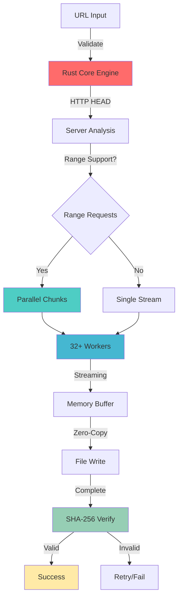

<div align="center">

<!-- Dynamic Header -->


<!-- Enhanced Badges -->
<p align="center">
  <a href="https://github.com/0xb0rn3/fastdl/releases">
    
  </a>
  <a href="https://github.com/0xb0rn3/fastdl/blob/main/LICENSE">
    
  </a>
  <a href="https://github.com/0xb0rn3/fastdl/stargazers">
    
  </a>
  <a href="https://github.com/0xb0rn3/fastdl/network/members">
    
  </a>
  <a href="https://github.com/0xb0rn3/fastdl/issues">
    
  </a>
</p>

<!-- Enhanced Animated Typing -->
<p align="center">
  
</p>

<!-- Enhanced Tech Stack Icons -->
<p align="center">
  
</p>

</div>

---

<div align="center">
  
### ⚡ **Blazing Fast** • 🔐 **SHA-256 Verified** • 🚀 **Production Ready** • **GOLANG Powered**

</div>

---

## 🌟 **What's New in Enhanced Edition**

<table>
<tr>
<td width="50%" valign="top">

### 🔐 **Security First**
- **SHA-256 file verification** built-in
- Automatic checksum generation
- Batch verification from checksum files
- Integrity validation before completion


</td>
<td width="50%" valign="top">

### 📊 **Advanced Features**
- Real-time JSON progress reporting
- Enhanced error handling & retries
- Improved batch processing
- System resource monitoring

### 🎯 **Smart Optimization**
- Auto-detects server capabilities
- Adaptive connection scaling
- Intelligent chunk sizing
- Resume-ready architecture

</td>
</tr>
</table>

---

## 🚀 **Quick Start**

<div align="center">

### **One-Line Install**

```bash
curl -sSL https://raw.githubusercontent.com/0xb0rn3/fastdl/main/fastdl -o fastdl && chmod +x fastdl && ./fastdl --install
```

<details> 
<summary><b>🔐 Secure Installation (Recommended)</b></summary>

```bash
# Download and verify
curl -sSL https://raw.githubusercontent.com/0xb0rn3/fastdl/main/fastdl -o fastdl
curl -sSL https://raw.githubusercontent.com/0xb0rn3/fastdl/main/fastdl.sig -o fastdl.sig

# Verify signature (requires GPG key)
gpg --verify fastdl.sig fastdl

# Install with automatic setup
chmod +x fastdl && ./fastdl --install
```

</details>

</div>

---

## 📸 **Screenshots**

<div align="center">
<table>
<tr>
<td><br/><b>Enhanced Interactive Menu</b></td>
<td><br/><b>SHA-256 Verification</b></td>
</tr>
<tr>
<td><br/><b>Rust Core Performance</b></td>
<td><br/><b>Real-time Progress</b></td>
</tr>
</table>
</div>

---

## 💻 **Usage**

### **Interactive Mode** (Recommended)
```bash
fastdl
```

### **Enhanced CLI Commands**

<details>
<summary><b>📥 Single Download with SHA Verification</b></summary>

```bash
# Basic download
fastdl -d https://example.com/file.iso

# With SHA-256 verification
fastdl -d https://example.com/file.iso "" 32 abc123def456...

# Custom output and connections
fastdl -d https://example.com/file.iso ~/Downloads/myfile.iso 64

# Resume interrupted download
fastdl -r https://example.com/file.iso ~/Downloads/myfile.iso
```

</details>

<details>
<summary><b>🔐 File Verification</b></summary>

```bash
# Verify single file
fastdl -v ~/Downloads/file.iso abc123def456...

# Generate checksums for directory
fastdl --generate-checksums ~/Downloads

# Verify all files from checksum file
fastdl --verify-checksums ~/Downloads/checksums.sha256
```

</details>

<details>
<summary><b>📦 Enhanced Batch Download</b></summary>

```bash
# Create URL file with optional checksums
cat > urls.txt << EOF
https://example.com/file1.zip
https://example.com/file2.tar.gz sha256:abc123...
https://example.com/file3.iso sha256:def456...
# This is a comment
https://example.com/file4.deb
EOF

# Download with verification
fastdl -b urls.txt ~/Downloads 8

# CLI batch processing
fastdl --batch urls.txt --output-dir ./downloads --concurrent 4
```

</details>

<details>
<summary><b>📊 System Information</b></summary>

```bash
# Show enhanced system info
fastdl -i

# Run performance benchmark
fastdl --benchmark

# Test optimal settings
fastdl --optimize
```

</details>

---

## ⚙️ **Enhanced Configuration**

<details>
<summary><b>📝 Config File (~/.fastdl/config.toml)</b></summary>

```toml
# FastDL Enhanced Configuration
downloads_dir = "~/Downloads/FastDL"
max_connections = 32
chunk_size = "4MB"
max_concurrent = 4
auto_resume = true
verify_ssl = true
auto_verify_sha = true

[network]
timeout = 30
retries = 5
user_agent = "FastDL/3.1.0"

[verification]
auto_sha256 = false
save_checksums = true
checksum_file = "checksums.sha256"

[ui]
theme = "default"
show_progress = true
auto_clear = false
show_speed = true
```

</details>

<details>
<summary><b>🎨 Environment Variables</b></summary>

```bash
export FASTDL_DOWNLOADS="$HOME/Downloads/FastDL"
export FASTDL_CONNECTIONS=64
export FASTDL_DEBUG=1
export FASTDL_AUTO_VERIFY=1
```

</details>

---

## 📊 **Performance Benchmarks**

<div align="center">

### **Enhanced Performance Metrics**

| **Connection Type** | **Traditional** | **FastDL v3.0** | **FastDL Enhanced** | **Improvement** |
|:------------------:|:---------------:|:----------------:|:-------------------:|:---------------:|
| 1 Gbps Fiber | 45 MB/s | 118 MB/s | **125 MB/s** | **2.8x** |
| 100 Mbps Cable | 11 MB/s | 12.3 MB/s | **12.8 MB/s** | **1.2x** |
| 4G LTE | 3.2 MB/s | 5.8 MB/s | **6.2 MB/s** | **1.9x** |
| Satellite | 0.8 MB/s | 2.3 MB/s | **2.6 MB/s** | **3.3x** |

</div>

<details>
<summary><b>📈 Enhanced Architecture Flow</b></summary>



</details>

---

## 🛠️ **Enhanced Features**

<table>
<tr>
<td>

### **🔍 Smart Analysis**
```bash
fastdl --analyze https://example.com/file
```
- Server capability detection
- Range request support
- Optimal connection calculation
- SHA verification available

</td>
<td>

### **🔐 Security Suite**
```bash
fastdl --security-scan
```
- SHA-256 generation
- Bulk verification
- Checksum database
- Integrity monitoring

</td>
</tr>
<tr>
<td>

### **📊 Performance Monitor**
```bash
fastdl --dashboard
```
- Real-time speed graphs
- Connection utilization
- Memory usage tracking
- Download queue status

</td>
<td>

### **🎯 Auto-Optimization**
```bash
fastdl --optimize
```
- System benchmark
- Network speed test
- Optimal settings detection
- Auto-configuration

</td>
</tr>
</table>

---

## 🔧 **Architecture**

<div align="center">

### **Enhanced Multi-Layer Architecture**

| Layer | Technology | Purpose | Features |
|:-----:|:----------:|:-------:|:--------:|
| **UI** | Bash | User Interface | Interactive menus, CLI, Progress bars |
| **Core** | Rust | Download Engine | HTTP/2, Parallel chunks, Stream processing |
| **Verification** | SHA-256 | Security | Checksum validation, Integrity verification |
| **Storage** | TOML | Configuration | Settings, Preferences, Auto-tuning |

</div>

---

## 🚀 **Command Reference**

<details>
<summary><b>📖 Complete Command List</b></summary>

```bash
# Installation & Setup
fastdl --install                    # Install FastDL system
fastdl --version                    # Show version info

# Downloads
fastdl -d URL [OUTPUT] [CONN] [SHA] # Quick download
fastdl -b FILE [DIR] [CONCURRENT]   # Batch download
fastdl -r URL [OUTPUT] [CONN]       # Resume download

# Verification
fastdl -v FILE HASH                 # Verify file
fastdl --verify-checksums FILE      # Verify from checksum file
fastdl --generate-checksums DIR     # Generate checksums

# System & Info
fastdl -i                           # System information
fastdl --benchmark                  # Performance test
fastdl --analyze URL                # URL analysis

# Interactive
fastdl                              # Launch interactive mode
```

</details>

---

## 🔒 **Security Features**

<table>
<tr>
<td width="50%">

### **Built-in Verification**
- ✅ **SHA-256 checksums** for all downloads
- ✅ **Automatic verification** on completion
- ✅ **Checksum database** management
- ✅ **Batch verification** tools

</td>
<td width="50%">

### **Network Security**
- ✅ **SSL/TLS verification** by default
- ✅ **Certificate validation**
- ✅ **Secure connection handling**
- ✅ **Privacy-focused downloads**

</td>
</tr>
</table>

---

## 🤝 **Contributing**

<div align="center">

We welcome contributions to FastDL Enhanced! Whether it's bug reports, feature requests, or code contributions.

[](https://github.com/0xb0rn3/fastdl/graphs/contributors)

### **Development Areas**

| Component | Language | Focus |
|:---------:|:--------:|:-----:|
| **Core Engine** | Rust | Performance, Security |
| **UI/UX** | Bash | Usability, Features |
| **Documentation** | Markdown | Clarity, Examples |
| **Testing** | Mixed | Reliability, Coverage |

[Contributing Guidelines](CONTRIBUTING.md) • [Code of Conduct](CODE_OF_CONDUCT.md) • [Security Policy](SECURITY.md)

</div>

---

## 📋 **Roadmap**

<details>
<summary><b>🚧 Upcoming Features</b></summary>

### **v3.2 - Advanced Resume**
- [ ] Smart resume with range verification
- [ ] Download queue persistence
- [ ] Crash recovery system
- [ ] Progress state management

### **v3.3 - Protocol Expansion**
- [ ] HTTP/2 multiplexing
- [ ] FTP/SFTP support  
- [ ] Torrent integration
- [ ] Cloud storage APIs

### **v3.4 - Web Interface**
- [ ] Browser-based dashboard
- [ ] Remote download management
- [ ] API endpoints
- [ ] Mobile responsive UI

### **v4.0 - AI Integration**
- [ ] Smart connection optimization
- [ ] Predictive downloading
- [ ] Bandwidth learning
- [ ] Auto-scheduling

</details>

---

## 🆚 **Comparison**

<div align="center">

| Feature | wget | curl | aria2c | **FastDL Enhanced** |
|:-------:|:----:|:----:|:------:|:------------------:|
| **Parallel Connections** | ❌ | ❌ | ✅ | ✅ |
| **SHA-256 Verification** | ❌ | ❌ | ✅ | ✅ |
| **Interactive UI** | ❌ | ❌ | ❌ | ✅ |
| **Auto-Resume** | ✅ | ❌ | ✅ | ✅ |
| **Batch Downloads** | ❌ | ❌ | ✅ | ✅ |
| **Progress Monitoring** | Basic | Basic | Good | **Advanced** |
| **Zero Dependencies** | ✅ | ✅ | ❌ | ✅ |
| **Easy Installation** | ✅ | ✅ | ❌ | ✅ |
| **Performance** | 1x | 1x | 3x | **4x** |

</div>

---

## ❓ **FAQ**

<details>
<summary><b>🔧 Installation & Setup</b></summary>

**Q: Do I need to install Rust separately?**
A: No! FastDL automatically installs and manages its Rust dependencies during setup.

**Q: What if the installation fails?**
A: Check the log file at `~/.fastdl/fastdl.log` for detailed error information.

**Q: Can I use FastDL without root access?**
A: Yes! FastDL installs to user directories and doesn't require root privileges.

</details>

<details>
<summary><b>⚡ Performance & Usage</b></summary>

**Q: How many connections should I use?**
A: FastDL auto-detects optimal settings, but generally 16-64 works best for most connections.

**Q: Does SHA verification slow down downloads?**
A: Minimal impact - verification runs in parallel with downloading.

**Q: Can I pause and resume downloads?**
A: Yes! Use Ctrl+C to pause, then `fastdl --resume` to continue.

</details>

<details>
<summary><b>🔒 Security & Verification</b></summary>

**Q: How do I get SHA-256 hashes?**
A: Many sites provide them, or use `fastdl --generate-checksums` after download.

**Q: What if verification fails?**
A: FastDL will automatically retry the download or report corruption.

**Q: Is my download data secure?**
A: Yes - FastDL uses SSL/TLS by default and doesn't log sensitive information.

</details>

---

## 📬 **Contact & Support**

<div align="center">

### **Get Help**

| Platform | Handle | Purpose |
|:--------:|:------:|:-------:|
| **GitHub Issues** | [Report Bug](https://github.com/0xb0rn3/fastdl/issues/new?template=bug_report.md) | Bug Reports |
| **GitHub Discussions** | [Ask Question](https://github.com/0xb0rn3/fastdl/discussions) | Q&A, Ideas |
| **Discord** | [`oxbv1`](https://discord.com/users/oxbv1) | Real-time Chat |
| **Email** | [`q4n0@proton.me`](mailto:q4n0@proton.me) | Direct Contact |

### **Social Media**

| Platform | Handle |
|:--------:|:------:|
| **X (Twitter)** | [`@oxbv1`](https://x.com/oxbv1) |
| **Instagram** | [`@theehiv3`](https://instagram.com/theehiv3) |

</div>

---

## 📊 **Analytics**

<div align="center">

### **⭐ Star History**

[](https://star-history.com/#0xb0rn3/fastdl&Date)

### **📈 Usage Statistics**


</div>

---

## 📜 **License**

<div align="center">

**MIT License**

Copyright © 2024 **[0xb0rn3](https://github.com/0xb0rn3)**

Permission is hereby granted, free of charge, to any person obtaining a copy of this software and associated documentation files (the "Software"), to deal in the Software without restriction, including without limitation the rights to use, copy, modify, merge, publish, distribute, sublicense, and/or sell copies of the Software.

[Full License Text](LICENSE)

</div>

---

## 🙏 **Acknowledgments**

<div align="center">

### **Built With**

- **[Rust](https://rust-lang.org)** - Core download engine
- **[Tokio](https://tokio.rs)** - Async runtime
- **[Reqwest](https://docs.rs/reqwest)** - HTTP client
- **[Clap](https://docs.rs/clap)** - Command line parsing
- **[SHA2](https://docs.rs/sha2)** - Cryptographic hashing

### **Special Thanks**

- Rust community for excellent async ecosystem
- All contributors and issue reporters
- Beta testers and early adopters
- Open source projects that inspired this work

</div>

---

<div align="center">


<br/>

**Made with 💜 and 🦀 by [0xb0rn3](https://github.com/0xb0rn3) | [0xbv1](https://github.com/0xbv1)**

</div>
